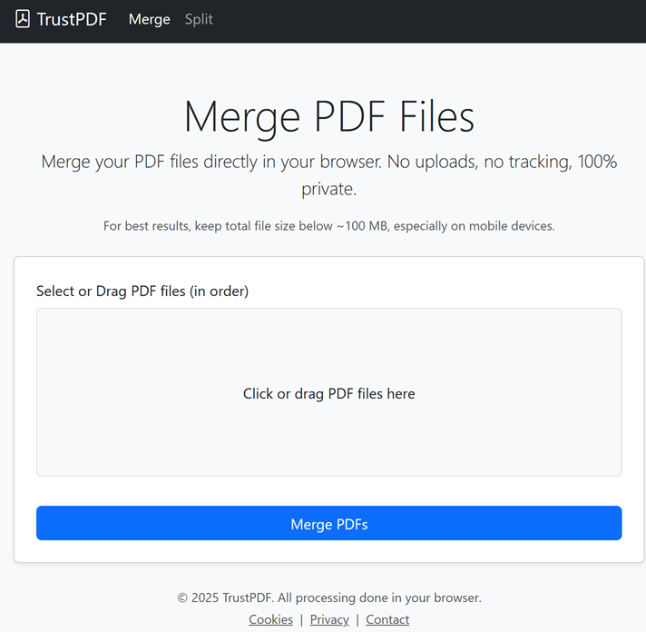
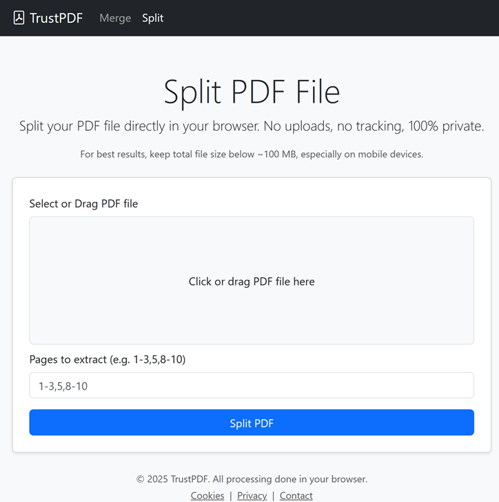

# TrustPDF

**TrustPDF** is a privacy-first, client-side PDF tool, released as open source under the AGPLv3 license.  
It allows you to **merge** and **split** PDF documents directly in your browser — with **no uploads, no accounts, no tracking**.

---

## 🌐 Live

👉 Visit: [https://www.trustpdf.net](https://www.trustpdf.net)

---

## 🚀 Features

- 🔒 100% **client-side** PDF processing — your files never leave your device
- 📎 Merge multiple PDFs into one
- ✂️ Extract pages from a PDF using flexible page ranges (e.g. `1-3,6,9`)
- 📱 Optimized for mobile and desktop use
- 🧭 No login, no storage, no third-party cookies — fully **private**
- 🧩 Built with PDF-Lib, Bootstrap 5, and SortableJS

---

## 📷 Screenshots

**Merge PDFs**  

**Split PDFs**  

---

## 🛠 Tech Stack

- [HTML5](https://developer.mozilla.org/en-US/docs/Web/HTML)
- [Bootstrap 5](https://getbootstrap.com/)
- [PDF-Lib](https://github.com/Hopding/pdf-lib)
- [SortableJS](https://github.com/SortableJS/Sortable)
- [Django](https://www.djangoproject.com/) (for static file delivery and routing)

---

## 📜 License

This project is licensed under the **GNU Affero General Public License v3.0 (AGPL-3.0)**.

You may:
- Use, modify, and share the code
- Run the software publicly (e.g. host it yourself)

You must:
- Publish the source code of any running version (e.g. on a website or SaaS)

📄 See [`LICENSE`](LICENSE) for details  
🔗 [Full AGPLv3 License Text](https://www.gnu.org/licenses/agpl-3.0.html)

---

## 🙋‍♂️ Author

Created by [mhostn3](https://github.com/mhostn3)  
🔗 [www.trustpdf.net](https://www.trustpdf.net)

---

## 📈 Analytics

We use [Umami Cloud](https://umami.is) for anonymous traffic analytics.  
No cookies, no tracking, no personal data collected.

---

## 🤝 Contributions

Pull requests are not accepted right now, but you are welcome to:
- [Open an issue](https://github.com/mhostn3/trustpdf/issues) for bugs or suggestions
- Fork the repo for learning, self-hosting, or private use

---

Thanks for respecting the values of TrustPDF: **privacy, simplicity, and transparency**.
